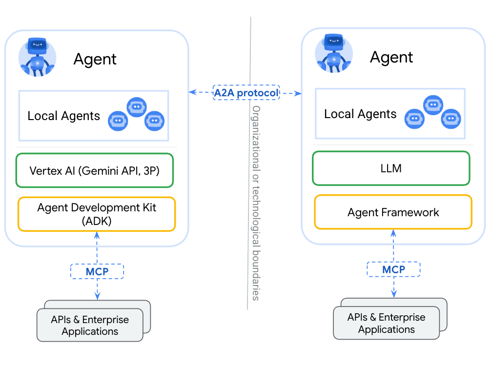

## 通过全新开放协议实现智能体间协同场景

* **无缝智能体协作**：建立标准协议使不同框架、厂商开发的不透明自治智能体能够高效互通，解决当前智能体互操作性问题
* **简化企业集成**：提供将智能体接入现有企业应用的标准化方案，赋能企业全域技术生态
* **满足核心企业需求**：提供企业级安全智能体生态所需的关键功能，包括能力发现、用户体验协商、任务与状态管理及安全协作

## 连接智能体的开放标准

* **MCP（模型上下文协议）** 用于工具资源连接
  * 通过结构化输入输出连接智能体与工具、API及资源
  * Google ADK支持MCP工具，可对接各类MCP服务端
* **A2A（智能体间协议）** 实现智能体协作
  * 不同智能体间动态多模态通信，无需共享内存、资源与工具
  * 社区驱动的开放标准
  * 提供基于Google ADK、LangGraph、Crew.AI的示例

## 反馈与演进

A2A是持续演进的项目，将根据社区反馈调整。本仓库包含初始规范、文档及[示例代码](https://github.com/google/A2A/tree/main/samples)。我们将持续更新更多功能、案例、规范及库文件，待规范与示例达到生产级SDK标准后将发布1.0稳定版本。

了解A2A设计原则及支持机构，请参阅[官方博客](https://developers.googleblog.com/en/a2a-a-new-era-of-agent-interoperability/)

参与贡献或了解协议内部细节？访问[GitHub仓库](https://github.com/google/A2A)

（注：图片路径及技术术语保持原格式未翻译，代码库链接保留原始英文）