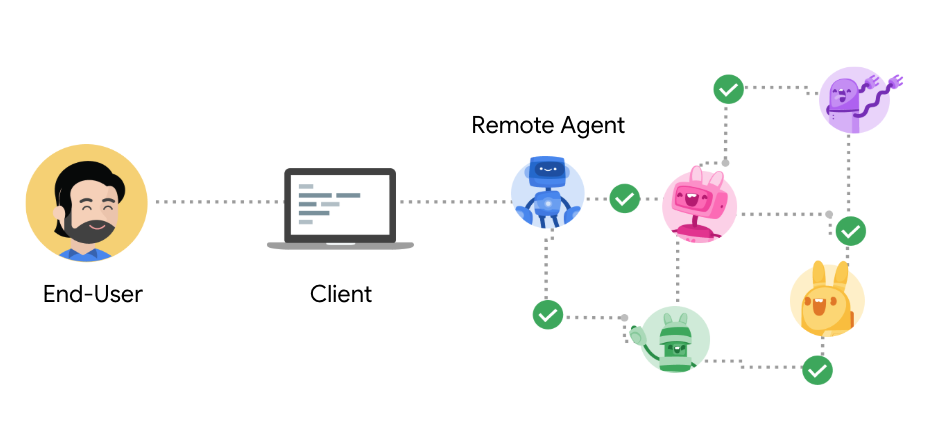

# Agent2Agent协议（A2A）

一个实现智能体间互操作的开放协议，弥合**不透明**智能体系统间的鸿沟。


<!-- TOC -->

- [Agent2Agent协议（A2A）](#agent2agent协议a2a)
  - [反馈与变更](#反馈与变更)
  - [核心原则](#核心原则)
    - [详细讨论](#详细讨论)
  - [概述](#概述)
    - [参与者](#参与者)
    - [传输层](#传输层)
    - [异步支持](#异步支持)
    - [认证与授权](#认证与授权)
  - [智能体名片](#智能体名片)
    - [发现机制](#发现机制)
    - [表示形式](#表示形式)
  - [智能体间通信](#智能体间通信)
  - [核心对象](#核心对象)
    - [任务](#任务)
    - [产出物](#产出物)
    - [消息](#消息)
    - [内容块](#内容块)
    - [推送通知](#推送通知)
- [示例方法与JSON响应](#示例方法与json响应)
  - [智能体名片](#智能体名片-1)
  - [发送任务](#发送任务)
  - [获取任务](#获取任务)
  - [取消任务](#取消任务)
  - [设置任务推送通知](#设置任务推送通知)
  - [获取任务推送通知](#获取任务推送通知)
  - [多轮对话](#多轮对话)
  - [流式支持](#流式支持)
    - [重新订阅任务](#重新订阅任务)
  - [非文本媒体](#非文本媒体)
  - [结构化输出](#结构化输出)
  - [错误处理](#错误处理)

<!-- /TOC -->

## 反馈与变更

A2A是持续演进的工作成果，将根据社区反馈进行调整。本仓库包含初始规范、文档和[示例代码](https://github.com/google/A2A/tree/main/samples)。我们将持续更新更多功能、示例、规范和库文件。当规范和示例达到生产级SDK标准时，将发布1.0版本并维护稳定版本。

## 核心原则

通过A2A协议，智能体在不为终端用户共享内存、思维或工具的情况下完成任务。智能体间交换的是原生模态下的上下文、状态、指令和数据。

- **简洁性**：复用现有标准
- **企业级支持**：认证、安全、隐私、追踪、监控
- **异步优先**：支持（超）长时任务和人工介入
- **模态无关**：文本、音视频、表单、iframe等
- **不透明执行**：智能体无需共享思维、计划或工具

### 详细讨论

- [A2A与MCP](topics/a2a_and_mcp.md?id=a2a-❤%ef%b8%8f-mcp)
- [企业级支持](topics/enterprise_ready.md?id=enterprise-readiness)
- [推送通知](topics/push_notifications.md?id=remote-agent-to-client-updates)
- [智能体发现](topics/agent_discovery.md?id=discovering-agent-cards)

## 概述

### 参与者

A2A协议包含三类参与者：

- **用户**  
  使用智能体系统完成任务的终端用户（人类或服务）。
- **客户端**  
  代表用户向不透明智能体发起请求的实体（服务、智能体、应用）。
- **远程智能体（服务端）**  
  作为A2A服务端的不透明（"黑盒"）智能体。

### 传输层

协议采用HTTP作为客户端与远程智能体间的传输协议。根据双方能力，可选用SSE实现服务端更新的流式传输。

A2A采用[JSON-RPC 2.0](https://www.jsonrpc.org/specification)作为客户端与远程智能体间的数据交换格式。

### 异步支持

A2A客户端和服务端可采用标准请求/响应模式并通过轮询获取更新。同时A2A支持通过SSE实现流式更新（连接状态下）以及断连时接收[推送通知](/topics/push_notifications.md?id=remote-agent-to-client-updates)。

### 认证与授权

A2A将智能体建模为企业级应用（因其不透明性且不共享工具和资源），从而快速实现企业级互操作。

A2A遵循[OpenAPI认证规范](https://swagger.io/docs/specification/v3_0/authentication/)。关键点在于：A2A智能体不在协议内交换身份信息，而是通过带外方式获取凭证材料，并通过HTTP头而非A2A载荷传输。

虽然A2A不内嵌身份传输，但服务端会在A2A载荷中声明认证要求。至少，服务端应在其[智能体名片](#智能体名片)中公布要求。[本文档](topics/agent_discovery.md?id=discovering-agent-cards)讨论了智能体名片的发现机制。

客户端应使用服务端公布的认证协议进行身份验证。A2A服务端应对**每个**请求进行认证，并通过标准HTTP状态码（401、403）及协议特定头信息（如包含[WWW-Authenticate](https://developer.mozilla.org/en-US/docs/Web/HTTP/Headers/WWW-Authenticate)头的HTTP 401响应）拒绝未认证请求。[企业级支持](topics/enterprise_ready.md)中有更详细讨论。

> 注：若智能体要求在执行任务时提供额外凭证（如使用特定工具），应返回状态为`Input-Required`的任务，其载荷包含认证结构体。客户端应再次通过带外方式获取凭证材料。

## 智能体名片

支持A2A的远程智能体需以JSON格式发布**智能体名片**，描述其能力/技能及认证机制。客户端通过智能体名片识别最适合执行任务的智能体，并利用A2A与之通信。

### 发现机制

建议智能体将其名片托管于https://`基础URL`/.well-known/agent.json。这与DNS发现机制兼容：客户端通过DNS获取服务端IP后发送HTTP GET请求获取名片。我们也预期系统将维护私有注册中心（如"智能体目录"或私有市场等）。更多讨论见[本文档](topics/agent_discovery.md?id=discovering-agent-cards)。

### 表示形式

智能体名片提案如下：

```typescript
// AgentCard传达关键信息：
// - 总体信息（版本、名称、描述、用途）
// - 技能：智能体可执行的能力集合
// - 默认支持的模态/内容类型
// - 认证要求
interface AgentCard {
  // 智能体的人类可读名称
  // (例："食谱智能体")
  name: string;
  // 智能体的人类可读描述，帮助用户和其他智能体理解其功能
  // (例："协助用户处理食谱和烹饪的智能体")
  description: string;
  // 智能体托管地址URL
  url: string;
  // 智能体服务提供商
  provider?: {
    organization: string;
    url: string;
  };
  // 智能体版本 - 格式由提供商决定 (例："1.0.0")
  version: string;
  // 智能体文档URL
  documentationUrl?: string;
  // 可选支持的扩展能力
  capabilities: {
    streaming?: boolean; // 是否支持SSE
    pushNotifications?: boolean; // 是否支持向客户端推送更新
    stateTransitionHistory?: boolean; //是否记录任务状态变更历史
  };
  // 智能体的认证要求
  // 设计匹配OpenAPI认证结构
  authentication: {
    schemes: string[]; // 如Basic, Bearer
    credentials?: string; //私有名片使用的凭证
  };
  // 智能体所有技能支持的交互模式
  // 可被单个技能覆盖
  defaultInputModes: string[]; // 支持的输入MIME类型
  defaultOutputModes: string[]; // 支持的输出MIME类型
  // 技能是智能体可执行的独立能力单元
  skills: {
    id: string; // 技能唯一标识符
    name: string; //技能的人类可读名称
    // 技能描述 - 帮助客户端或人类理解功能
    description: string;
    // 描述该技能能力类别的标签集
    // (如"烹饪", "客户支持", "计费")
    tags: string[];
    // 技能可执行的示例场景
    // 帮助客户端理解使用方式 (如"我需要面包食谱")
    examples?: string[]; // 任务示例提示
    // 技能支持的交互模式
    // (若与默认不同)
    inputModes?: string[]; // 支持的输入MIME类型
    outputModes?: string[]; // 支持的输出MIME类型
  }[];
}
```

## 智能体间通信

客户端与远程智能体的通信以**_任务完成为导向_**，通过协作满足终端用户请求。任务对象使得双方能协作完成提交的任务。

远程智能体可立即完成任务或执行长时间运行任务。对于长时任务，客户端可轮询智能体获取最新状态。智能体也可通过SSE（连接时）或外部通知服务向客户端推送更新。

## 核心对象

### 任务

任务是有状态实体，允许客户端与远程智能体达成特定目标并生成结果。双方在任务中交换消息，远程智能体生成产出物。

任务始终由客户端创建，状态始终由远程智能体决定。多个任务可属于同一会话（通过可选sessionId标识）。客户端创建任务时可设置可选sessionId。

智能体可：
- 立即完成请求
- 调度后续工作
- 拒绝请求
- 协商不同模态
- 要求客户端提供更多信息
- 委托其他智能体和系统

即使目标达成后，客户端仍可在同一任务上下文中请求更多信息或变更（如客户端："画一只兔子"，智能体："<图片>"，客户端："改成红色"）。

任务用于传输[产出物](#产出物)（结果）和[消息](#消息)（思考、指令等）。任务维护状态及可选的历史状态和消息记录。

```typescript
interface Task {
  id: string; // 任务唯一标识符
  sessionId: string; // 客户端生成的会话ID
  status: TaskStatus; // 任务当前状态
  history?: Message[]; // 消息历史记录
  artifacts?: Artifact[]; // 智能体生成的产出物集合
  metadata?: Record<string, any>; // 扩展元数据
}
// 任务状态及伴随消息
interface TaskStatus {
  state: TaskState;
  message?: Message; // 给客户端的附加状态更新
  timestamp?: string; // ISO时间戳
}
// 服务端在sendSubscribe或subscribe请求中发送
interface TaskStatusUpdateEvent {
  id: string;
  status: TaskStatus;
  final: boolean; // 标识事件流结束
  metadata?: Record<string, any>;
}
// 服务端在sendSubscribe或subscribe请求中发送
interface TaskArtifactUpdateEvent {
  id: string;
  artifact: Artifact;
  metadata?: Record<string, any>;
}
// 客户端发送给智能体以创建、继续或重启任务
interface TaskSendParams {
  id: string;
  sessionId?: string; //未设置时服务端为新任务创建sessionId
  message: Message;
  historyLength?: number; // 要获取的最近消息数量
  // 断连时服务端发送通知的目标
  pushNotification?: PushNotificationConfig;
  metadata?: Record<string, any>; // 扩展元数据
}
type TaskState =
  | "submitted"   // 已提交
  | "working"     // 处理中
  | "input-required" // 需输入
  | "completed"   // 已完成
  | "canceled"    // 已取消
  | "failed"      // 已失败
  | "unknown";    // 未知状态
```

### 产出物

智能体生成产出物作为任务的最终结果。产出物不可变，可命名，可包含多个部分。流式响应可向现有产出物追加内容。

单个任务可生成多个产出物。例如"创建网页"可能生成独立的HTML和图片产出物。

```typescript
interface Artifact {
  name?: string;    // 产出物名称
  description?: string; // 描述
  parts: Part[];    // 内容块集合
  metadata?: Record<string, any>; // 元数据
  index: number;    // 索引号
  append?: boolean; // 是否为追加内容
  lastChunk?: boolean; // 是否为最后一块
}
```

### 消息

消息包含非产出物的任何内容，包括智能体思考、用户上下文、指令、错误、状态或元数据。

客户端的所有内容都以消息形式发送。智能体通过消息传递状态或指令（而生成的结果作为产出物发送）。

消息可包含多个部分以表示不同内容。例如用户请求可包含文本描述和多个作为上下文的文件。

```typescript
interface Message {
  role: "user" | "agent"; // 发送者角色
  parts: Part[];          // 内容块集合
  metadata?: Record<string, any>; // 元数据
}
```

### 内容块

客户端与远程智能体间交换的完整内容单元，作为消息或产出物的组成部分。每个内容块有自己的内容类型和元数据。

```typescript
interface TextPart {  // 文本块
  type: "text";
  text: string;
}
interface FilePart {  // 文件块
  type: "file";
  file: {
    name?: string;    // 文件名
    mimeType?: string; // MIME类型
    // 以下三选一
    bytes?: string;   // base64编码内容
    uri?: string;     // 资源标识符
  };
}
interface DataPart {  // 数据块
  type: "data";
  data: Record<string, any>; // 结构化数据
}
type Part = (TextPart | FilePart | DataPart) & {
  metadata: Record<string, any>; // 元数据
};
```

### 推送通知

A2A支持安全通知机制，使智能体能在断连时通过推送通知服务向客户端发送更新。在企业环境中，智能体必须验证通知服务身份，向服务认证自身，并提供与执行任务绑定的标识符。

推送通知服务的目标服务器应视为独立服务，不保证（也不预期）是客户端直接接收。该服务负责认证授权智能体，并将验证后的通知代理到适当端点（可能是pub/sub队列、电子邮件等）。

在特殊场景下（如VPC内的本地服务网格），客户端可选择开放端口自行作为通知服务。任何企业级实现都应具备集中式服务，用可信凭证认证远程智能体，并处理在线/离线场景（类似移动推送通知服务）。

```typescript
interface PushNotificationConfig {
  url: string;       // 通知接收URL
  token?: string;    // 任务/会话专属令牌
  authentication?: { // 认证配置
    schemes: string[]; // 认证方案
    credentials?: string; // 凭证
  };
}
interface TaskPushNotificationConfig {
  id: string; // 任务ID
  pushNotificationConfig: PushNotificationConfig;
}
```

# 示例方法与JSON响应

## 智能体名片

```json
//智能体名片
{
  "name": "谷歌地图智能体",
  "description": "规划路线、记忆地点、生成导航指示",
  "url": "https://maps-agent.google.com",
  "provider": {
    "organization": "Google",
    "url": "https://google.com"
  },
  "version": "1.0.0",
  "authentication": {
    "schemes": "OAuth2"
  },
  "defaultInputModes": ["text/plain"],
  "defaultOutputModes": ["text/plain", "application/html"],
  "capabilities": {
    "streaming": true,
    "pushNotifications": false
  },
  "skills": [
    {
      "id": "route-planner",
      "name": "路线规划",
      "description": "帮助规划两地间的路线",
      "tags": ["地图", "路线", "导航"],
      "examples": [
        "规划从Sunnyvale到Mountain View的路线",
        "工作日上午9点从Sunnyvale到旧金山的通勤时间",
        "生成从Sunnyvale到Mountain View的转向指示"
      ],
      // 可返回路线视频
      "outputModes": ["application/html", "video/mp4"]
    },
    {
      "id": "custom-map",
      "name": "我的地图",
      "description": "管理包含自定义地点的个人地图",
      "tags": ["自定义地图", "收藏地点"],
      "examples": [
        "显示我最爱的餐厅地图",
        "生成我去过所有地点的年度可视化"
      ],
      "outputModes": ["application/html"]
    }
  ]
}
```

## 发送任务

允许客户端向远程智能体发送内容以创建新任务、恢复中断任务或重新打开已完成任务。任务中断可能因需要用户输入或运行时错误导致。

```json
//请求
{
  "jsonrpc": "2.0",
  "id": 1,
  "method":"tasks/send",
  "params": {
    "id": "de38c76d-d54c-436c-8b9f-4c2703648d64",
    "message": {
      "role":"user",
      "parts": [{
        "type":"text",
        "text": "讲个笑话"
      }]
    },
    "metadata": {}
  }
}
//响应
{
  "jsonrpc": "2.0",
  "id": 1,
  "result": {
    "id": "de38c76d-d54c-436c-8b9f-4c2703648d64",
    "sessionId": "c295ea44-7543-4f78-b524-7a38915ad6e4",
    "status": {
      "state": "completed",
    },
    "artifacts": [{
      "name":"笑话",
      "parts": [{
          "type":"text",
          "text":"鸡为什么过马路？为了到对面去！"
        }]
      }],
    "metadata": {}
  }
}
```

## 获取任务

客户端可通过此方法检索任务的生成产出物。智能体决定已提交任务的保留期限。对于超出保留期限或智能体未持久化的短期任务，智能体可能返回错误码。

客户端可请求任务的最近N条历史记录（包含按顺序排列的所有消息）。默认为0（无历史记录）。

```json
//请求
{
  "jsonrpc": "2.0",
  "id": 1,
  "method":"tasks/get",
  "params": {
    "id": "de38c76d-d54c-436c-8b9f-4c2703648d64",
    "historyLength": 10,
    "metadata": {}
  }
}
//响应
{
  "jsonrpc": "2.0",
  "id": 1,
  "result": {
    "id": "de38c76d-d54c-436c-8b9f-4c2703648d64",
    "sessionId": "c295ea44-7543-4f78-b524-7a38915ad6e4",
    "status": {
      "state": "completed"
    },
    "artifacts": [{
      "parts": [{
        "type":"text",
        "text":"鸡为什么过马路？为了到对面去！"
      }]
    }],
    "history":[
      {
        "role": "user",
        "parts": [
          {
            "type": "text",
            "text": "讲个笑话"
          }
        ]
      }
    ],
    "metadata": {}
  }
}
```

## 取消任务

客户端可取消已提交的任务。

```json
//请求
{
  "jsonrpc": "2.0",
  "id": 1,
  "method":"tasks/cancel",
  "params": {
    "id": "de38c76d-d54c-436c-8b9f-4c2703648d64",
    "metadata": {}
  }
}
//响应
{
  "jsonrpc": "2.0",
  "id": 1,
  "result": {
    "id": 1,
    "sessionId": "c295ea44-7543-4f78-b524-7a38915ad6e4",
    "status": {
      "state": "canceled"
    },
    "metadata": {}
  }
}
```

## 设置任务推送通知

客户端可配置推送通知URL以接收任务状态变更。

```json
//请求
{
  "jsonrpc": "2.0",
  "id": 1,
  "method":"tasks/pushNotification/set",
  "params": {
    "id": "de38c76d-d54c-436c-8b9f-4c2703648d64",
    "pushNotificationConfig": {
      "url": "https://example.com/callback",
      "authentication": {
        "schemes": ["jwt"]
      }
    }
  }
}
//响应
{
  "jsonrpc": "2.0",
  "id": 1,
  "result": {
    "id": "de38c76d-d54c-436c-8b9f-4c2703648d64",
    "pushNotificationConfig": {
      "url": "https://example.com/callback",
      "authentication": {
        "schemes": ["jwt"]
      }
    }
  }
}
```

## 获取任务推送通知

客户端可检索任务的当前推送通知配置。

```json
//请求
{
  "jsonrpc": "2.0",
  "id": 1,
  "method":"tasks/pushNotification/get",
  "params": {
    "id": "de38c76d-d54c-436c-8b9f-4c2703648d64"
  }
}
//响应
{
  "jsonrpc": "2.0",
  "id": 1,
  "result": {
    "id": "de38c76d-d54c-436c-8b9f-4c2703648d64",
    "pushNotificationConfig": {
      "url": "https://example.com/callback",
      "authentication": {
        "schemes": ["jwt"]
      }
    }
  }
}
```

## 多轮对话

当任务需要额外用户输入时，远程智能体会暂停执行并进入`input-required`状态。此时客户端必须提供额外输入以使任务继续。

`input-required`状态包含的消息必须指明客户端需执行的操作，如"填写表单"或"登录SaaS服务foo"。若涉及结构化数据，指令应作为一个`Part`发送，结构化数据作为另一个`Part`。

```json
//请求 - 序列1
{
  "jsonrpc": "2.0",
  "id": 1,
  "method":"tasks/send",
  "params": {
    "id": "de38c76d-d54c-436c-8b9f-4c2703648d64",
    "message": {
      "role":"user",
      "parts": [{
        "type":"text",
        "text": "帮我申请新手机"
      }]
    },
    "metadata": {}
  }
}
//响应 - 序列2
{
  "jsonrpc": "2.0",
  "id": 1,
  "result": {
    "id": "de38c76d-d54c-436c-8b9f-4c2703648d64",
    "sessionId": "c295ea44-7543-4f78-b524-7a38915ad6e4",
    "status": {
      "state": "input-required",
      "message": {
        "parts": [{
          "type":"text",
          "text":"选择手机类型(iPhone/Android)"
        }]
      }
    },
    "metadata": {}
  }
}
//请求 - 序列3
{
  "jsonrpc": "2.0",
  "id": 2,
  "method":"tasks/send",
  "params": {
    "id": "de38c76d-d54c-436c-8b9f-4c2703648d64",
    "sessionId": "c295ea44-7543-4f78-b524-7a38915ad6e4",
    "message": {
      "role":"user",
      "parts": [{
        "type":"text",
        "text": "Android"
      }]
    },
    "metadata": {}
  }
}
//响应 - 序列4
{
  "jsonrpc": "2.0",
  "id": 2,
  "result": {
    "id": 1,
    "sessionId": "c295ea44-7543-4f78-b524-7a38915ad6e4",
    "status": {
      "state": "completed"
    },
    "artifacts": [{
      "name": "订单确认",
      "parts": [{
          "type":"text",
          "text":"已为您订购Android设备，申请编号R12443"
        }],
      "metadata": {}
    }],
    "metadata": {}
  }
}
```

## 流式支持

对于支持SSE的客户端和远程智能体，创建新任务时可使用`tasks/sendSubscribe`方法。远程智能体可响应任务状态更新事件流（传递状态变更或指令）和任务产出物更新事件流（传递生成结果）。

注意任务产出物更新事件可向现有产出物追加内容。客户端可通过`task/get`在流式传输外获取完整产出物。智能体必须在流结束时或需要用户输入时设置final: true属性。

```json
//请求
{
  "method":"tasks/sendSubscribe",
  "params": {
    "id": "de38c76d-d54c-436c-8b9f-4c2703648d64",
    "sessionId": "c295ea44-7543-4f78-b524-7a38915ad6e4",
    "message": {
      "role":"user",
      "parts": [{
        "type":"text",
        "text": "根据附图撰写长篇文章"
      },{
        "type":"file",
        "file": {
           "mimeType": "image/png",
           "data":"<base64编码内容>"
        }
      }]
    },
    "metadata": {}
  }
}

//响应
data: {
  "jsonrpc": "2.0",
  "id": 1,
  "result": {
    "id": 1,
    "status": {
      "state": "working",
      "timestamp":"2025-04-02T16:59:25.331844"
    },
    "final": false
  }
}

data: {
  "jsonrpc": "2.0",
  "id": 1,
  "result": {
    "id": 1,    
    "artifact": [
      "parts": [
        {"type":"text", "text": "<章节1...>"}
      ],
      "index": 0,
      "append": false,      
      "lastChunk": false
    ]
  }
}
data: {
  "jsonrpc": "2.0",
  "id": 1,
  "result": {
    "id": 1,  
    "artifact": [
      "parts": [
        {"type":"text", "text": "<章节2...>"}
      ],
      "index": 0,
      "append": true,      
      "lastChunk": false
    ]
  }
}
data: {
  "jsonrpc": "2.0",
  "id": 1,
  "result": {
    "id": 1,    
    "artifact": [
      "parts": [
        {"type":"text", "text": "<章节3...>"}
      ],
      "index": 0,
      "append": true,
      "lastChunk": true
    ]
  }
}

data: {
  "jsonrpc": "2.0",
  "id": 1,
  "result": {
    "id": 1,
    "status": {
      "state": "completed",
      "timestamp":"2025-04-02T16:59:35.331844"
    },
    "final": true
  }
}
```

### 重新订阅任务

断连的客户端可重新订阅支持流式传输的远程智能体，通过SSE接收任务更新。

```json
//请求
{
  "method":"tasks/resubscribe",
  "params": {
    "id": "de38c76d-d54c-436c-8b9f-4c2703648d64",
    "metadata": {}
  }
}
//响应
data: {
  "jsonrpc": "2.0",
  "id": 1,
  "result": {
    "id": "de38c76d-d54c-436c-8b9f-4c2703648d64",
    "artifact":[
      "parts": [
        {"type":"text", "text": "<章节2...>"}
      ],
      "index": 0,
      "append": true,
      "lastChunk":false
    ]
  }
}
data: {
  "jsonrpc": "2.0",
  "id": 1,
  "result": {
    "id": "de38c76d-d54c-436c-8b9f-4c2703648d64",
    "artifact":[
      "parts": [
        {"type":"text", "text": "<章节3...>"}
      ],
      "index": 0,
      "append": true,
      "lastChunk": true
    ]   
  }
}

data: {
  "jsonrpc": "2.0",
  "id": 1,
  "result": {
    "id": 1,
    "status": {
      "state": "completed",
      "timestamp":"2025-04-02T16:59:35.331844"
    },
    "final": true
  }
}
```

## 非文本媒体

客户端与智能体间非文本数据交互示例。

```json
//请求 - 序列1
{
  "jsonrpc": "2.0",
  "id": 9,
  "method":"tasks/send",
  "params": {
    "id": "de38c76d-d54c-436c-8b9f-4c2703648d64",
    "sessionId": "c295ea44-7543-4f78-b524-7a38915ad6e4",
    "message": {
      "role":"user",
      "parts": [{
        "type":"text",
        "text": "分析附件报告并生成概要"
      },{
        "type":"file",
        "file": {
           "mimeType": "application/pdf",
           "data":"<base64编码内容>"
        }
      }]
    },
    "metadata": {}
  }
}
//响应 - 序列2
{
  "jsonrpc": "2.0",
  "id": 9,
  "result": {
    "id": "de38c76d-d54c-436c-8b9f-4c2703648d64",
    "sessionId": "c295ea44-7543-4f78-b524-7a38915ad6e4",
    "status": {
      "state": "working",
      "message": {
        "role": "agent",
        "parts": [{
          "type":"text",
          "text":"分析进行中，请稍候"
        }],
        "metadata": {}
       }
     },
    "metadata": {}
  }
}
//请求 - 序列3
{
  "jsonrpc": "2.0",
  "id": 10,
  "method":"tasks/get",
  "params": {
    "id": "de38c76d-d54c-436c-8b9f-4c2703648d64",
    "metadata": {}
  }
}
//响应 - 序列4
{
  "jsonrpc": "2.0",
  "id": 9,
  "result": {
    "id": "de38c76d-d54c-436c-8b9f-4c2703648d64",
    "sessionId": "c295ea44-7543-4f78-b524-7a38915ad6e4",
    "status": {
      "state": "completed"
     },
    "artifacts": [{
      "parts": [{
        "type":"text",
        "text":"<生成的概要内容>"
       }],
       "metadata": {}
     }],
    "metadata": {}
  }
}
```

## 结构化输出

客户端或智能体可要求对方返回结构化输出。

```json
//请求
{
  "jsonrpc": "2.0",
  "id": 9,
  "method":"tasks/send",
  "params": {
    "id": "de38c76d-d54c-436c-8b9f-4c2703648d64",
    "sessionId": "c295ea44-7543-4f78-b524-7a38915ad6e4",
    "message": {
      "role":"user",
      "parts": [{
        "type":"text",
        "text": "显示我的未解决IT工单列表",
        "metadata": {
          "mimeType": "application/json",
          "schema": {
            "type": "array",
            "items": {
              "type": "object",
              "properties": {
                "ticketNumber": { "type": "string" },
                "description": { "type": "string" }
              }
            }
          }
        }
      }]
    },
    "metadata": {}
  }
}
//响应
{
  "jsonrpc": "2.0",
  "id": 9,
  "result": {
    "id": "de38c76d-d54c-436c-8b9f-4c2703648d64",
    "sessionId": "c295ea44-7543-4f78-b524-7a38915ad6e4",
    "status": {
      "state": "working",
      "message": {
        "role": "agent",
        "parts": [{
            "type":"text",
            "text":"[{\"ticketNumber\":\"REQ12312\",\"description\":\"VPN访问请求\"},{\"ticketNumber\":\"REQ23422\",\"description\":\"添加至DL - team-gcp-onboarding\"}]"
        }],
        "metadata": {}
      }
    },
    "metadata": {}
  }
}
```

## 错误处理

服务端处理客户端请求出错时，使用以下错误消息格式响应。

```typescript
interface ErrorMessage {
  code: number;     // 错误码
  message: string;  // 错误信息
  data?: any;       // 附加数据
}
```

服务端响应错误场景时可使用的标准JSON-RPC错误码：

| 错误码         | 消息               | 描述                                      |
| :------------- | :----------------- | :---------------------------------------- |
| \-32700        | JSON解析错误       | 接收到无效JSON                            |
| \-32600        | 无效请求           | 请求载荷验证错误                          |
| \-32601        | 方法未找到         | 无效方法名                                |
| \-32602        | 无效参数           | 方法参数无效                              |
| \-32603        | 内部错误           | JSON-RPC内部错误                          |
| \-32000至\-32099 | 服务端错误         | 保留用于实现特定的错误码                  |
| \-32001        | 任务未找到         | 提供的ID无对应任务                        |
| \-32002        | 任务不可取消       | 远程智能体不允许取消该任务                |
| \-32003        | 不支持推送通知     | 智能体不支持推送通知功能                  |
| \-32004        | 不支持的操作       | 无效操作类型                              |
| \-32005        | 不兼容的内容类型   | 客户端与智能体间内容类型不兼容            |