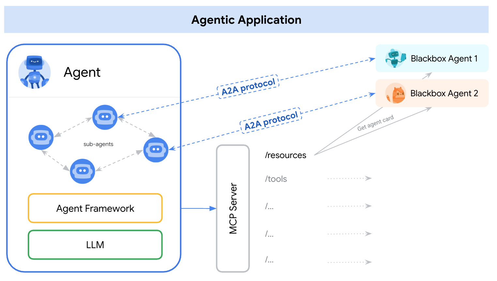

# A2A ❤️ MCP

**摘要**：智能体应用需要同时使用A2A和MCP协议。我们推荐用MCP对接工具，用A2A对接智能体。

<!-- TOC -->
- [A2A ❤️ MCP](#a2a-️-mcp)
  - [为何需要协议？](#为何需要协议)
  - [互补关系](#互补关系)
  - [应用示例](#应用示例)
  - [交叉领域](#交叉领域)

<!-- /TOC -->

## 为何需要协议？
标准协议对于实现智能体互操作性至关重要，特别是在连接智能体与外部系统时。这主要体现在两个创新领域：工具和智能体。

**工具**是具有结构化输入输出和（通常）明确行为的原子能力。**智能体**是能通过使用工具、推理和用户交互来完成新任务的自主应用。智能体应用必须同时使用工具**和**其他智能体来实现用户目标。

## 互补关系
[模型上下文协议](https://modelcontextprotocol.io/)（MCP）是连接大语言模型与数据、资源和工具的新兴标准。我们已经观察到MCP正在不同模型和框架间标准化"函数调用"功能。这正在形成一个工具服务提供商生态系统，显著降低了智能体与工具连接的复杂度。随着更多框架、服务商和平台采用MCP，这一趋势将持续深化。

A2A则聚焦于不同的问题领域。A2A是应用层协议，使智能体能够以其自然模态进行协作。它允许智能体以*智能体*（或用户）身份而非工具身份进行交互。我们希望A2A能作为MCP的补充协议获得广泛采用，共同构建智能体生态系统。

## 应用示例
通过汽车维修场景说明：

*假设某汽车修理厂拥有自主工作的机械师，他们使用专用工具（如举升机、万用表、套筒扳手）来诊断和修复问题。机械师常需要处理未见过的故障，维修过程可能涉及与客户的大量沟通、研究以及零件供应商协作。*

将机械师建模为AI智能体时：

* MCP是连接这些智能体与结构化工具（如`升高平台2米`、`将扳手向右旋转4毫米`）的协议。

* A2A则是让终端用户或其他智能体与维修厂交互（*"我的车有异响"*）的协议。A2A支持持续的多轮对话和动态计划调整（*"请发送左轮照片"*、*"发现液体泄漏，这种情况持续多久了？"*），也能帮助维修厂与零件供应商等其他智能体协作。

## 交叉领域
我们建议应用将A2A智能体建模为MCP资源（通过[智能体名片](/documentation.md#agent-card)表示）。这样框架就可以使用A2A与用户、远程智能体及其他智能体进行通信。

